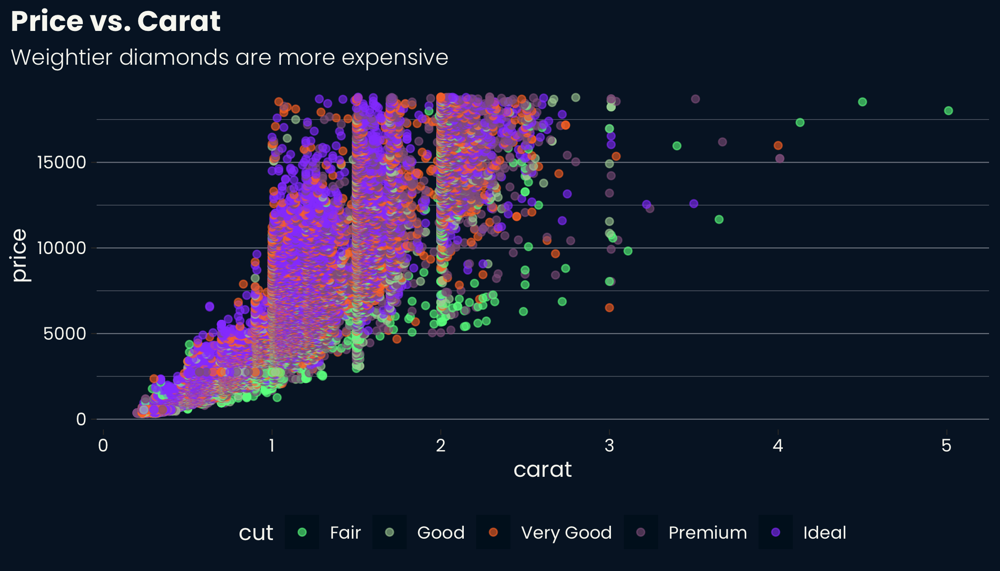
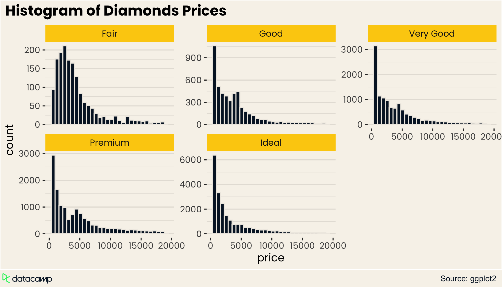

<!-- README.md is generated from README.Rmd. Please edit that file -->

# ggdc

<!-- badges: start -->
<!-- badges: end -->

The goal of ggdc is to provides Datacamp themes for ggplot2.

## Installation

You can install the package from github using `devtools`.

``` r
devtools::install_github("datacamp/ggdc")
```

## Example

This is a basic example which shows you how to solve a common problem:

``` r
library(ggdc)
p <- diamonds %>%
  ggplot(aes(x = carat, y = price, color = cut)) +
  geom_point(alpha = 0.6) +
  labs(
    title = "Price vs. Carat",
    subtitle = "Weightier diamonds are more expensive"
  ) +
  scale_color_datacamp(palette = "accents_light")

p +
  theme_datacamp_light()
```

<figure>
<a href="man/figures/README-example_1-1.png" data-fancybox="">
 </a>
<figcaption>
</figcaption>
</figure>

``` r
p + theme_datacamp_dark()
```

<figure>
<a href="man/figures/README-example_2-1.png" data-fancybox="">
 </a>
<figcaption>
</figcaption>
</figure>

## Example 2

``` r
diamonds %>%
  ggplot(aes(x = price)) +
  geom_histogram() +
  facet_wrap(~cut, scales = "free_y") +
  labs(
    title = "Histogram of Diamonds Prices",
    caption = "Source: ggplot2"
  ) +
  theme_datacamp_light() +
  scale_fill_datacamp()
```

<figure>
<a href="man/figures/README-example-3-1.png" data-fancybox="">
 </a>
<figcaption>
</figcaption>
</figure>
