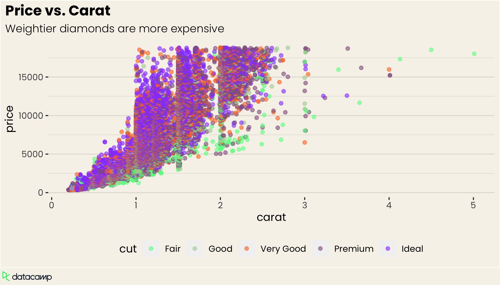
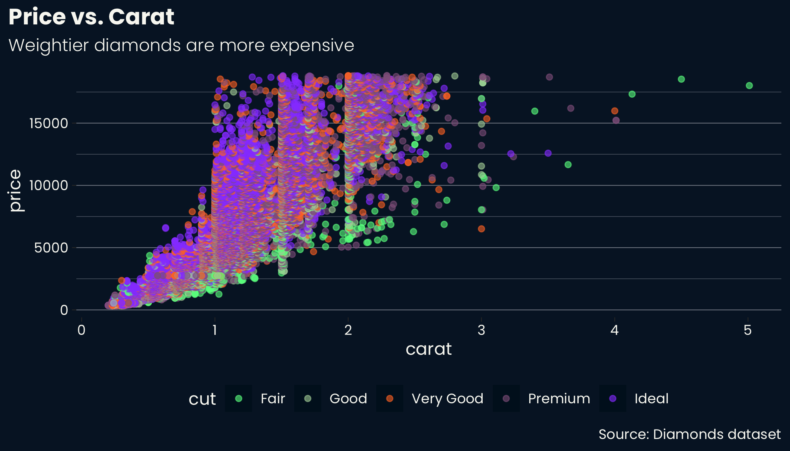
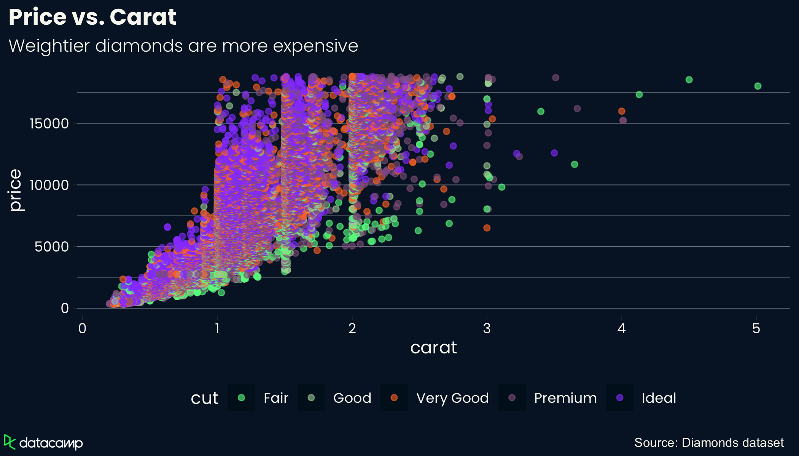
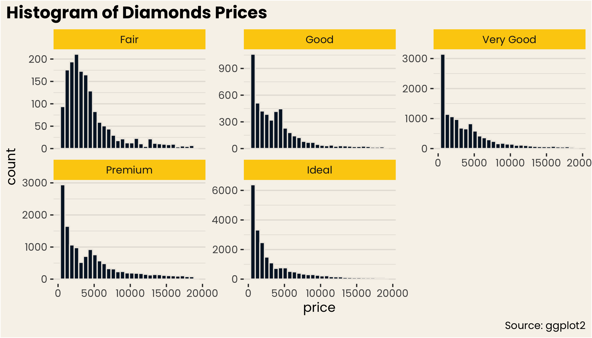

<!-- README.md is generated from README.Rmd. Please edit that file -->

# ggdc

<!-- badges: start -->
<!-- badges: end -->

The goal of ggdc is to provides Datacamp themes for ggplot2, rstudio,
and other document formats.

## Installation

You can install the package from github using `devtools`.

``` r
devtools::install_github("datacamp/ggdc")
```

## Plotting Theme

`ggdc` supports two variants of the datacamp theme (light and dark).

## Light Theme

``` r
library(ggdc)
p <- diamonds %>%
  ggplot(aes(x = carat, y = price, color = cut)) +
  geom_point(alpha = 0.6) +
  labs(
    title = "Price vs. Carat",
    subtitle = "Weightier diamonds are more expensive",
    caption = "Source: Diamonds dataset"
  ) +
  scale_color_datacamp(palette = "accents_light")

p +
  theme_datacamp_light()
```

<figure>
<a href="man/figures/README-example_1-1.png" data-fancybox="">
 </a>
<figcaption>
</figcaption>
</figure>

### Dark Theme

``` r
p +
  theme_datacamp_dark()
```

<figure>
<a href="man/figures/README-dark-theme-1.png" data-fancybox="">
 </a>
<figcaption>
</figcaption>
</figure>

### Logo

You can add a logo to the plot using `finalize_plot`. You can make this
the default for all plots in an Rmd by adding
`dc_set_chunk_opts(finalize_plot = TRUE)` in the setup chunk.

``` r
finalize_plot(p + theme_datacamp_dark())
```

<figure>
<a href="man/figures/README-unnamed-chunk-1-1.png" data-fancybox="">
 </a>
<figcaption>
</figcaption>
</figure>

### Facets

``` r
diamonds %>%
  ggplot(aes(x = price)) +
  geom_histogram() +
  facet_wrap(~cut, scales = "free_y") +
  labs(
    title = "Histogram of Diamonds Prices",
    caption = "Source: ggplot2"
  ) +
  theme_datacamp_light() +
  scale_fill_datacamp()
```

<figure>
<a href="man/figures/README-example-facets-1.png" data-fancybox="">
 </a>
<figcaption>
</figcaption>
</figure>

## Rstudio Theme

`ggdc` also ships with a syntax highlighting theme for RStudio. You can
install it by running

``` r
install_rstheme()
```
